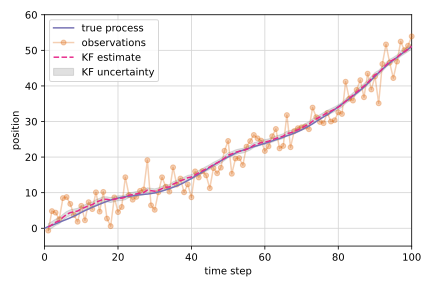
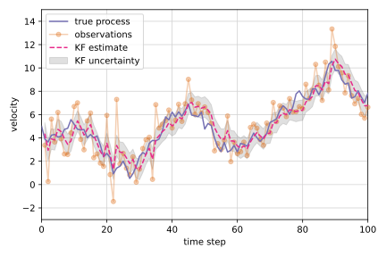

# Machine learning examples

  
  

This repository contains a small archive of machine learning and data science examples.
They were originally intended to act as a reference and educational resource for myself.
Maybe, for some reason, they turn out to be useful for others, too.
Most of the example notebooks contain a brief theoretical introduction followed by a small practical experiment.

## Notebooks

- [A/B testing](notebooks/ab_testing.ipynb)
- [Clustering](notebooks/clustering.ipynb)
- [Harmonic oscillator](notebooks/harmonic_oscillator.ipynb)
- [Kalman filtering](notebooks/kalman_filter.ipynb)
- [Nonlinear filtering](notebooks/nonlinear_filters.ipynb)
- [PCA](notebooks/pca.ipynb)
- [System identification](notebooks/system_identification.ipynb)
